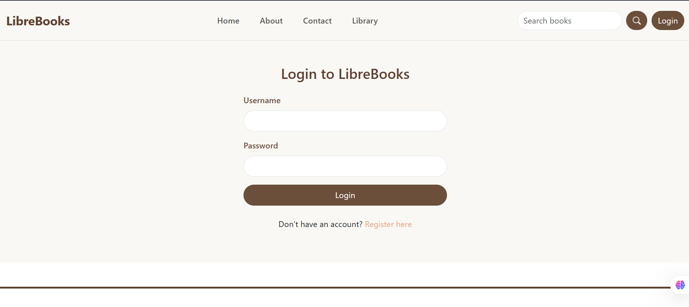

# LibreBooks

**LibreBooks** is a beautifully designed full-stack Django web application for book lovers. Users can **read books online**, **register an account**, **manage personal profiles**, and soon—**build a wishlist of favorite titles**. With a clean UI, personalized dashboards, and a seamless reading experience, LibreBooks aims to be your go-to digital bookshelf.

---

## Key Features

### User Authentication

- Register, Login, Logout system using Django's built-in auth.
- Flash messages (success, error, info) for user interactions.

### User Profiles

- Upload profile images (stored with user-specific paths).
- Add bio, location, and date of birth.
- Option to change password from Edit Profile page.
- View account metadata: Date Joined, Last Login, Account Type.
- Full **Edit Profile** functionality with image preview and styled UI.

### Book Reading System

- Users can browse and **read PDF books directly in-browser** .
- Global search functionality and categories to filter books.

### Wishlist

- Users can add/remove books to/from a personal wishlist.
- Wishlist items visible on the dashboard.
- Wishlist count and quick access button in dashboard UI.

---

## 🛠️ Tech Stack

| Layer        | Technology           |
|--------------|----------------------|
| Backend      | Django 5.1           |
| Frontend     | HTML, CSS, Bootstrap 5 |
| Database     | SQLite (default)     |
| Styling      | Custom Bootstrap theming (brown & cream aesthetic) |
| Media Upload | Django file storage (`MEDIA_ROOT`) for profile images |

---

## 🎨 UI Screens

| Home Page | Library Page | Login Page |
|-----------|--------------|------------|
|  |  |  | 

| Book Detail Page | Wishlist |
|------------------|----------|
| |  |

| Dashboard | Edit Profile | 
|-----------|--------------|
|  |  | 

## Contact

For any inquiries or feedback, please contact:

- **Name**: Simran  
- **GitHub**: [SIMRAN-202](https://github.com/SIMRAN-202)  
- **Email**: kaursimrankaur2003@gmail.com
